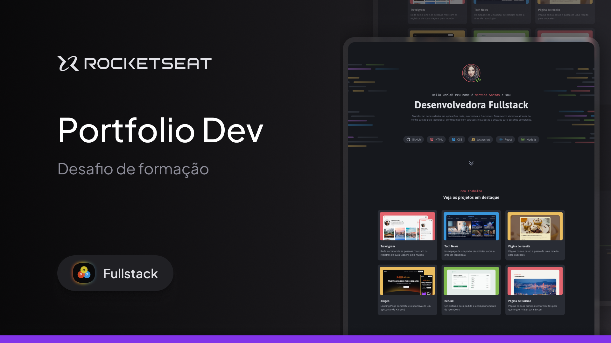

# Portfólio Dev

O projeto é um site desktop de portfólio para desenvolvedores, com links para projetos e contato do profissional. 

## Preview

  

Acesse o projeto online:

[https://vitorcosta2612.github.io/portfolio-dev/](https://vitorcosta2612.github.io/portfolio-dev/)

## Tecnologias utilizadas

* HTML
* CSS
* GitHub Pages

## Objetivo do projeto

O principal objetivo deste projeto foi praticar conceitos de front-end.

Durante o desenvolvimento, foram trabalhados conceitos como:

* Estruturação de páginas com HTML
* Estilização com CSS
* Responsividade
* Organização visual de conteúdo
* Uso de grids e flexbox
* Hierarquia de informações
* Reprodução de layouts inspirados em sites reais

## Autor

Desenvolvido por Vitor Costa.
